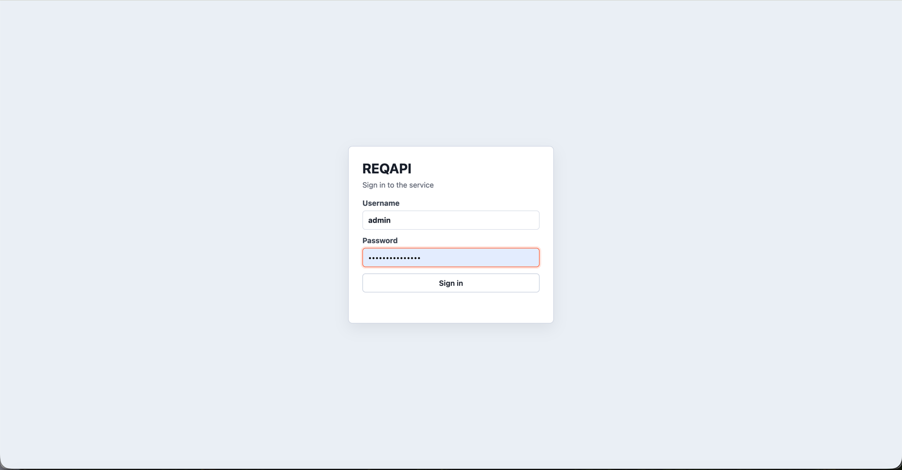
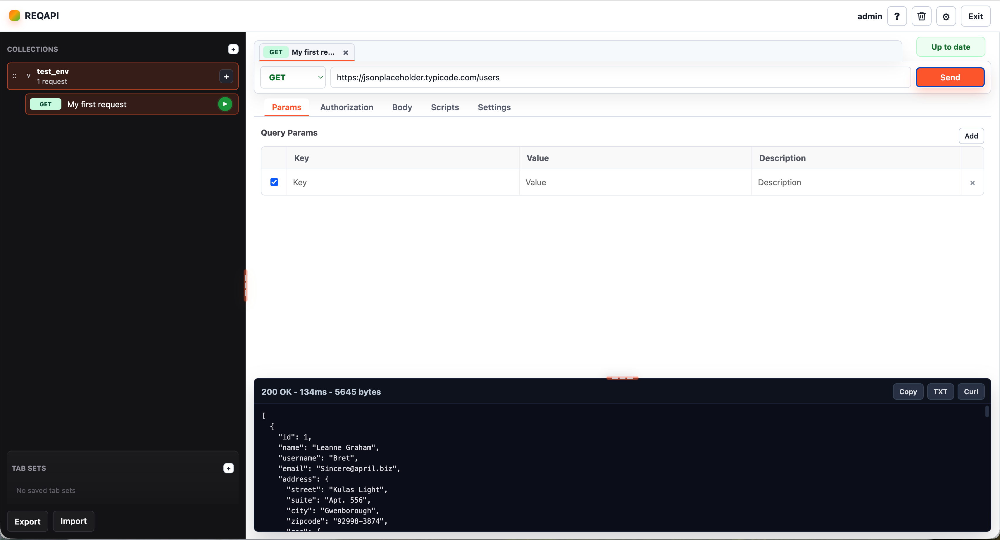
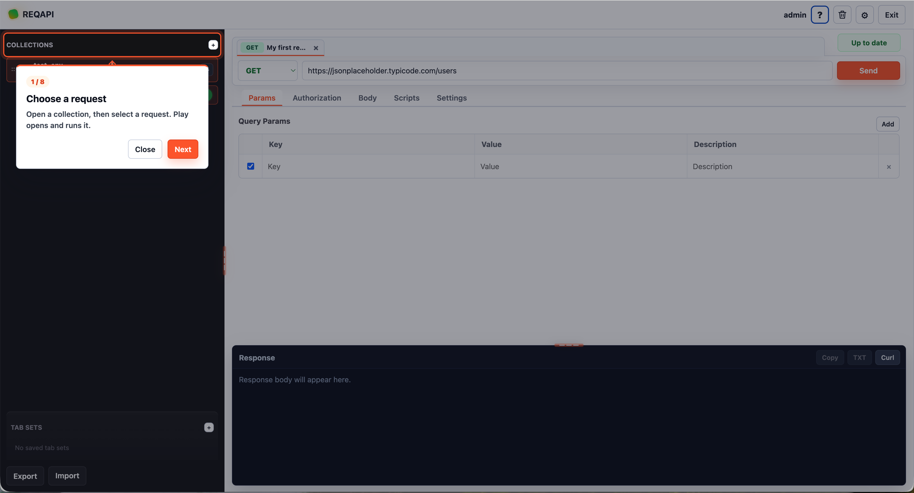
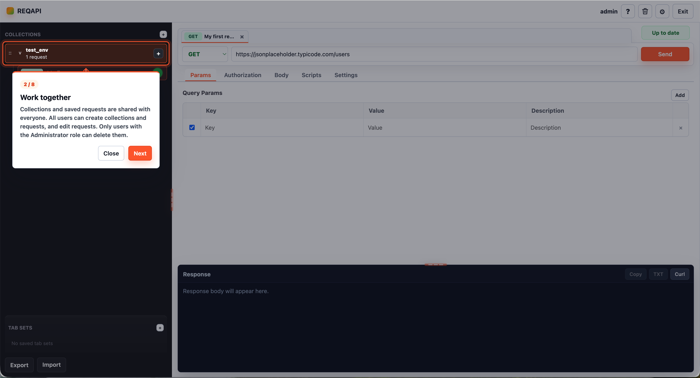
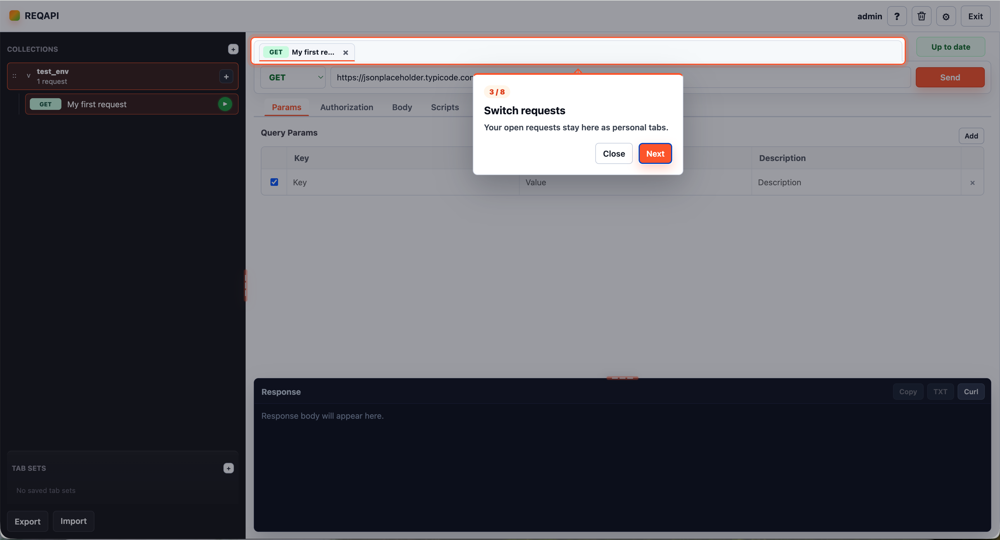
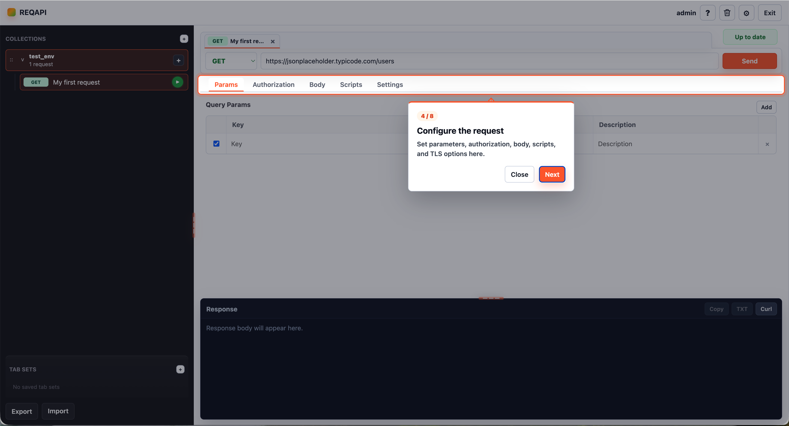
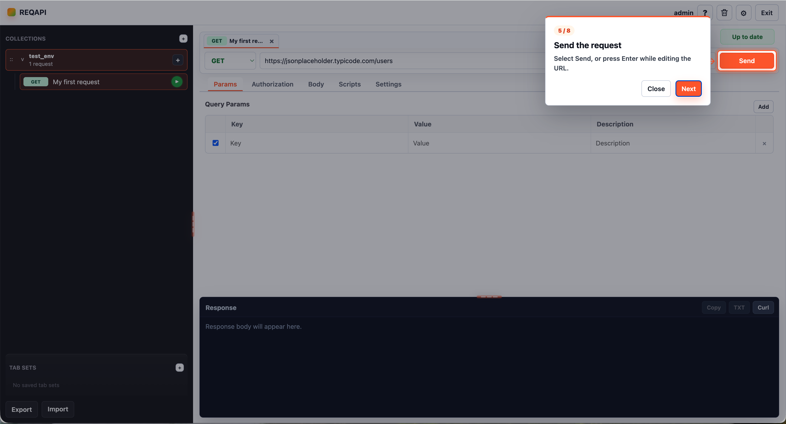
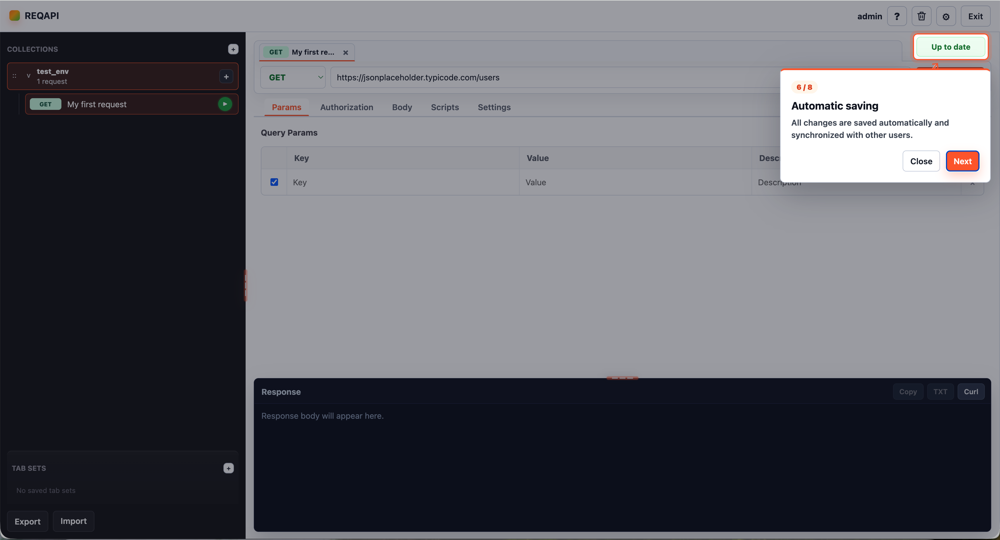
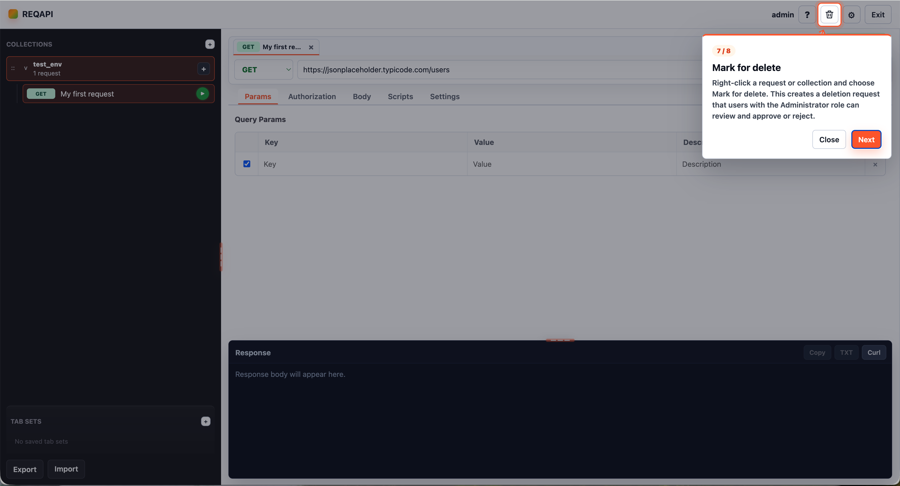
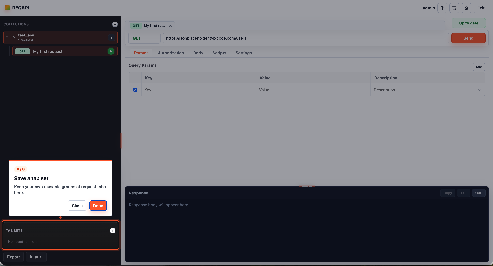

# REQAPI

A self-hosted API testing platform for teams designed and developed with AI assistance..

## Quick Start

```bash
cd /path/to/REQAPI
python3 -m venv .venv
source .venv/bin/activate
python -m pip install -r requirements.txt
python -m reqapi --host 127.0.0.1 --port 8765
```

Open [http://127.0.0.1:8765](http://127.0.0.1:8765).

## Why REQAPI Exists

REQAPI is designed for organizations that need a collaborative REST API
workspace while keeping requests, credentials, collections, and user data
inside their own infrastructure.

- The UI runs in a browser.
- Requests are executed by the REQAPI backend, not directly by the browser.
- Collections are shared so colleagues can work on the same API definitions.
- Open tabs and saved tab sets are private to each user.
- No external REQAPI cloud service is required.

## Screenshots

### Sign In



Users sign in through the browser. A new non-admin username starts the standard
account creation flow, while the initial `admin` account is configured during
the first clean deployment.

### Request Workspace



The workspace combines shared collections, request tabs, the request editor,
and the response panel.

### Guided Onboarding

The built-in tour is shown on a user's first sign-in and can be opened again
from the help button.

#### 1. Choose a request



Open a collection and select a saved request. Play opens and runs it.

#### 2. Work together



Collections and requests are shared, while deletion is restricted to
administrators.

#### 3. Switch requests



Open requests remain available as personal tabs.

#### 4. Configure a request



Configure parameters, authorization, body, scripts, and TLS options.

#### 5. Send the request



Select Send or press Enter while editing the URL.

#### 6. Automatic saving



Changes are saved automatically and synchronized with other users.

#### 7. Mark for delete



Users can request deletion of a collection or request for an administrator to
review.

#### 8. Save a tab set



Tab sets keep reusable personal groups of request tabs.

## Main Features

### Requests

- HTTP methods: `GET`, `POST`, `PUT`, `PATCH`, `DELETE`, `HEAD`, and `OPTIONS`
- Query parameters with enabled/disabled state and descriptions
- Bearer Token and Basic Auth authorization
- Per-request authorization values and settings
- Send from the button, collection Play button, or Enter in the URL field
- Readable JSON responses, response copy, and `.txt` download
- Per-request TLS certificate verification setting
- No request execution history is stored

### Request Bodies

- `none`
- `form-data`, including text and file fields
- `x-www-form-urlencoded`
- raw `JSON` or `Text`
- binary file upload
- GraphQL query and variables

Files selected in `form-data` or `binary` mode are stored with the saved
request. Treat the database as sensitive data.

### Scripts

Each request has `Pre-request` and `Post-response` script editors. Scripts run
in an isolated browser worker with REQAPI's supported `pm` API subset. They are
useful for changing request data before sending and checking a response after
it arrives.

### Collaboration

Collections and requests are shared by all users:

- Every user can create collections and requests.
- Every user can edit and save shared requests, including params, body,
  authorization, scripts, and TLS settings.
- Only users with the **Administrator** role can delete collections or requests.
- Only users with the **Administrator** role can import or export collections.

Open tabs, the active tab, and tab sets belong to the current user. One user's
workspace is not shown to another user, and it remains available after logout,
login, service restart, or VM restart.

## Reset the Admin Password

If the `admin` password is lost, reset only that password from the server. This
operation preserves users, collections, requests, credentials, and workspaces.

For a systemd installation:

```bash
cd /opt/reqapi
sudo systemctl stop reqapi
sudo -u reqapi ./.venv/bin/python scripts/reset_admin_password.py
sudo systemctl start reqapi
```

The script prompts for the new password without displaying it. Existing admin
sessions are invalidated, so the administrator must sign in again.

For a local installation, stop REQAPI and run:

```bash
python3 scripts/reset_admin_password.py
```

## VM Installation

Copy the project to the VM, for example to `/opt/reqapi`, then run:

```bash
cd /opt/reqapi
sudo ./scripts/install_vm.sh
```

For a domain-based deployment, the expected request path is:

```text
Browser
  -> http://reqapi.example.internal:80
  -> nginx redirects HTTP to HTTPS
  -> https://reqapi.example.internal:443
  -> nginx terminates TLS
  -> http://127.0.0.1:8765 (REQAPI, available only inside the VM)
```

Port `80` is normally used only for plain HTTP and redirection to HTTPS. Users
open the service through HTTPS on port `443`; because `443` is the standard
HTTPS port, it does not need to be written in the browser URL. REQAPI itself
must not listen publicly on ports `80` or `443` when nginx is used.

The installer:

- creates the `.venv` virtual environment;
- installs Python dependencies;
- creates a dedicated `reqapi` system user;
- installs and enables a systemd service;
- restarts REQAPI automatically after a crash or VM reboot;
- installs a one-minute health-check timer;
- preserves the existing `data/` directory during updates.

Useful commands:

```bash
sudo systemctl status reqapi --no-pager
sudo systemctl restart reqapi
sudo journalctl -u reqapi -f
```

By default, the installer binds REQAPI to `127.0.0.1:8765`. If nginx is already
configured to proxy to `127.0.0.1:8080`, install REQAPI on that local port:

```bash
sudo ./scripts/install_vm.sh --port 8080
```

## Updating an Existing VM

Do not overwrite the server's `data/` directory. A typical update from a local
checkout is:

```bash
rsync -az --delete \
  --exclude 'data/' \
  --exclude '.venv/' \
  --exclude '.git/' \
  --exclude 'exports/' \
  ./ user@server:/tmp/reqapi/
```

Then, on the VM:

```bash
sudo rsync -a --delete \
  --exclude 'data/' \
  --exclude '.venv/' \
  /tmp/reqapi/ /opt/reqapi/
cd /opt/reqapi
sudo ./scripts/install_vm.sh
```

The database remains in `/opt/reqapi/data/` and survives the update.

## License

REQAPI is released under the [MIT License](LICENSE). The license permits use,
copying, modification, and redistribution of cloned copies. It does not grant
other users write access to the original GitHub repository; repository access
and protected branch rules are managed separately in GitHub.
